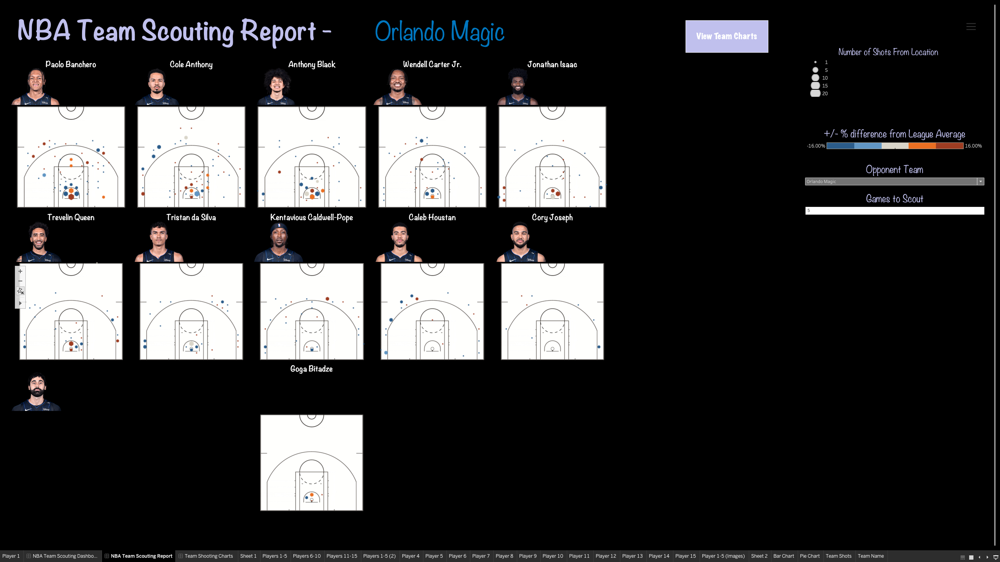
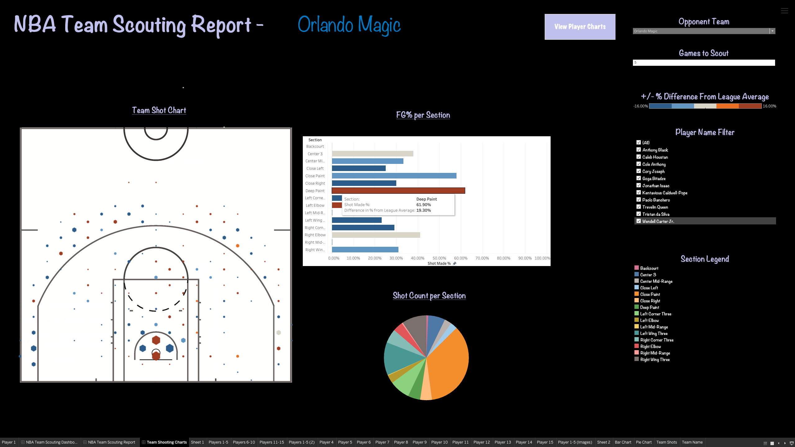
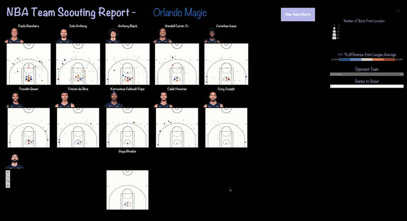
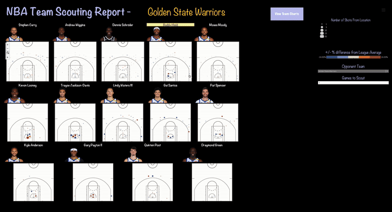
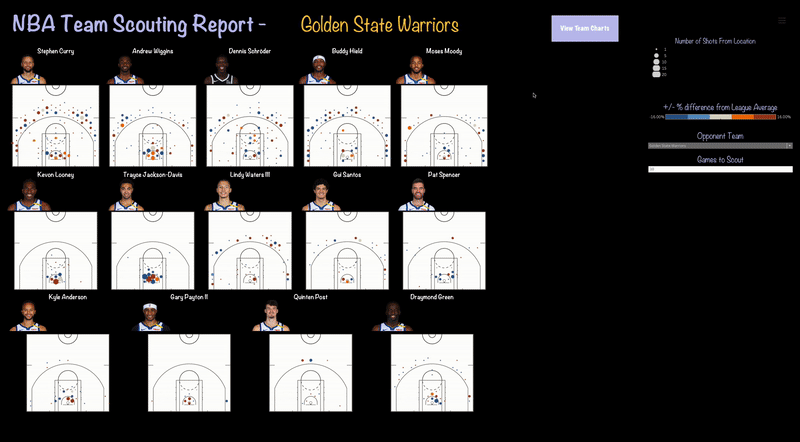

# NBA Team Scouting

This project is designed to help scout NBA teams and players, analyze their statistics, and generate insights for performance evaluation. The project includes automated data updates, PostgreSQL integration for data storage, and various analysis tools to assess player and team performance.

## Features

- **Automated Data Updates**: A cron job updates player/team statistics and other relevant data daily, ensuring the data is always up-to-date.
- **Database Integration**: PostgreSQL is used to store player and team statistics.
- **Data Visualization**: Generate meaningful shot charts and shooting statistics from the data to assist with scouting reports.
- **Player and Team Analysis**: Use the information in the shot charts to create gameplans for opposing NBA teams. 

## Examples
- **Player Reports:**

- **Team Report:**

- **1.** 

- **2.** 

- **3.** 

