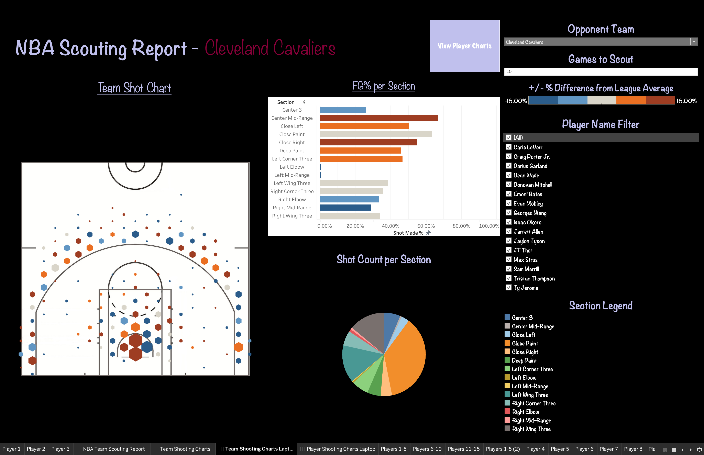

# NBA Team Scouting

This project is designed to help scout NBA teams and players, analyze their statistics, and generate insights for performance evaluation. The project includes automated data updates, PostgreSQL integration for data storage, and various analysis tools to assess player and team performance.

## Features

- **Data Extraction**: Data is gathered through multiple endpoints from [`nba_api`](https://github.com/swar/nba_api).
- **Data Manipulation**: Generated additional data fields using pandas to enhance visualization and analysis.
- **Automated Data Updates**: A cron job updates player/team statistics and other relevant data daily, ensuring the data is always up-to-date.
- **Database Integration**: PostgreSQL is used to store player and team statistics.
- **Data Visualization**: Generate meaningful shot charts and shooting statistics from the data to assist with scouting reports.
- **Player and Team Analysis**: Use the information in the shot charts to create gameplans for opposing NBA teams. 

## Player Reports
The Player Reports display the shooting charts of the top 15 players of the selected team. They are ordered in rows with the top 5 players (ranked by total shots taken in the past 5 games) in the first row, the top 10 in the second row, and top 15 in the last row. **Note:** While you can adjust the number of previous games to scout, players will **always** be ranked based on their total shots taken in the **team’s last 5 games**. The hexagonal bins on each shooting chart represent a cluster of shots taken by the given player in that vicinity. The size of the bin indicates the number of shots taken at that location, and the color of each bin represents the difference in the shootings percentage from the league average in that section.  Blue indicates below-average shooting efficiency at that location, while red signifies above-average efficiency.

## Team Reports
The Team Reports have information on the team's shooting as a whole. The **Team Shot Chart** depicts the shooting for all filtered players on the team. The size and color of each bin works the same way as it does for the player charts. Also included in the Team Report is the **FG% per Section** bar graph. This graph visually compares the team's shooting percentages to league averages for each section on the court. Like the other two charts on this screen, it will update in real time based on the selected players in the Player Name Filter. The third visualization here is the **Shot Count per Section** chart. This simple pie chart quickly conveys the volume of shots the team takes from each section. The colors on the chart correspond to the Section Legend to the right of the chart.

## Example Usage
- **1. Selecting a Team**: In the Opponent Team dropdown, select the team you would like to scout. The charts will update to the reflect the team you've chosen. 

- **2. Enter Number of Games to Scout**: By default, the number of previous games to scout is set to 5. This means all shots for the last 5 games the team played will be counted in the all charts. If a player missed any of these games due to injury or other reasons, their shot count for those games will be zero. The number of most recent games to scout can be changed by typing in a new number. Once entered, the charts will update automatically to fit the new number specified. 

- **3. Transitioning and Displaying Extra Info**: The player and team views can be interchanged quickly by selecting the purple "View Player/Team Charts" button on the top of the screen. Once you have selected the desired view, you can hover over any of the charts for extra information/highlighting. Hovering over bins on the shot charts will display three different types of information. The first is **Section** info, which displays the total shots taken in the current section along with the shooting percentage in that section. For the player charts, these stats are specific to the given player, and for team charts they are based on the entire team's performance. Next is the **This Location** info, which has similar info but is related to the specific location hovered over, as opposed to the section as a whole. In addition to the shot count and FG%, the chart displays the FG% **difference** from the league average.  Lastly comes the **League Average for Section** line, which shows the **actual** League Average FG% value for that section.   

